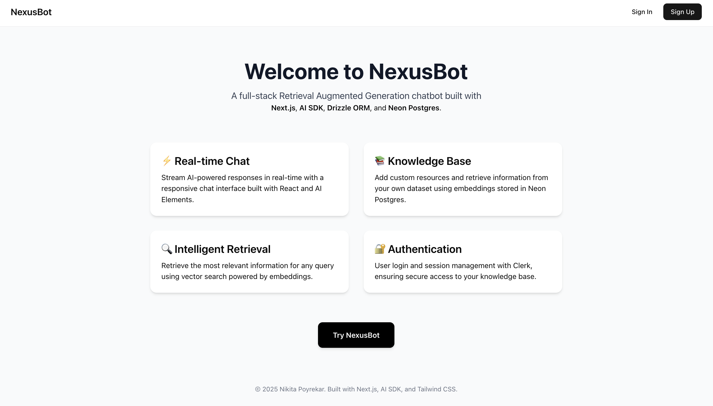
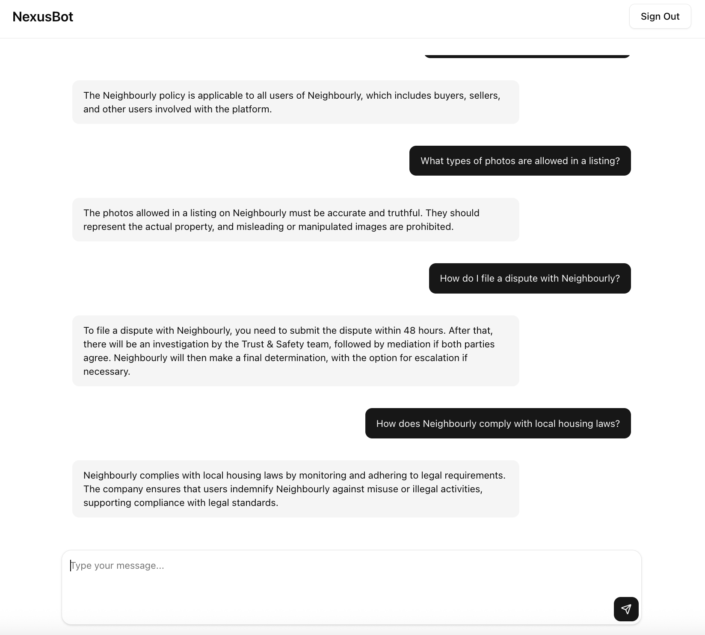

# Nexus Chatbot built using React, Next.js, AI SDK, Neon, Drizzle, Clerk

A full-stack Retrieval-Augmented Generation (RAG) chatbot built with Next.js, AI SDK, Drizzle ORM, and Neon Postgres.  
It allows users to chat with AI that can retrieve information from a custom knowledge base.

## Tech Stack
- **Frontend:** React, Next.js 14 (App Router), Tailwind CSS, AI Elements
- **Backend:** Next.js API routes, AI SDK (for embeddings, retrieval, and streaming)
- **Database:** Neon (PostgreSQL with pgvector)
- **ORM:** Drizzle ORM
- **Auth:** Clerk
- **Deployment:** Vercel / AWS / Render (your choice)

## Features
- Retrieval-Augmented Generation (RAG) pipeline  
- Upload and chunk custom data sources  
- Embeddings generation and vector search with Neon  
- Streaming AI chat responses  
- Authentication and user sessions via Clerk  
- Full-stack TypeScript setup with Drizzle ORM  
- Clean and responsive chat UI built with AI Elements

## Screenshots
Home page

Chatbot UI

## Documentation
Click [here](https://deepwiki.com/nikitapoyarekar05/nexus-bot/1-overview) for detailed documentation

## 💡 Application
This RAG Chatbot can be applied in a variety of real-world scenarios where context-aware and domain-specific answers are required:
1. **Customer Support Automation**  
   - Integrate with your website or product to provide instant, accurate answers to frequently asked questions using your internal knowledge base.
2. **Internal Knowledge Management**  
   - Employees can query company documents, policies, or technical manuals quickly, reducing time spent searching for information.
3. **Education & Training**  
   - Students or trainees can ask questions about course materials, manuals, or technical content and get precise, sourced responses.
4. **Content Retrieval for SaaS or Enterprise Apps**  
   - Enhance your product by enabling users to interact with large sets of documentation, wikis, or reports through a chat interface.
5. **Personal Knowledge Assistant**  
   - Users can feed in personal notes, research papers, or PDFs to create a smart assistant that answers questions based on their own data.
     
> Essentially, any scenario where users need AI to provide accurate answers grounded in a custom dataset or documents can benefit from this chatbot.

